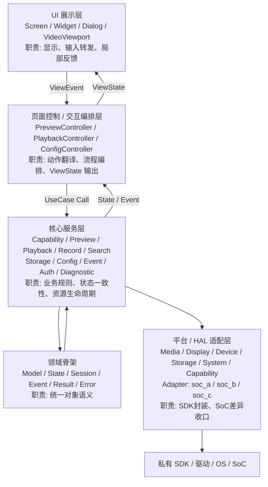
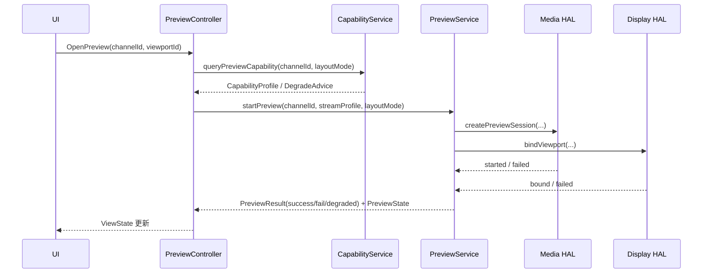
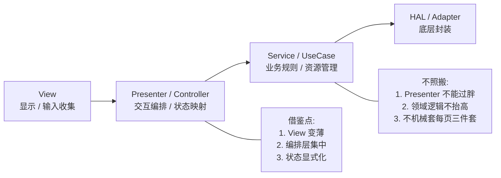

# NVR 架构图（V1.2）

## 1. 总体逻辑图

```mermaid
flowchart TB
    UI[UI 展示层\nScreen / Widget / Dialog / VideoViewport\n职责: 显示、输入转发、局部反馈]
    CTRL[页面控制 / 交互编排层\nPreviewController / PlaybackController / ConfigController\n职责: 动作翻译、流程编排、ViewState 输出]
    SRV[核心服务层\nCapability / Preview / Playback / Record / Search\nStorage / Config / Event / Auth / Diagnostic\n职责: 业务规则、状态一致性、资源生命周期]
    DOMAIN[领域骨架\nModel / State / Session / Event / Result / Error\n职责: 统一对象语义]
    HAL[平台 / HAL 适配层\nMedia / Display / Device / Storage / System / Capability\nAdapter: soc_a / soc_b / soc_c\n职责: SDK封装、SoC差异收口]
    SDK[私有 SDK / 驱动 / OS / SoC]

    UI -->|ViewEvent| CTRL
    CTRL -->|UseCase Call| SRV
    SRV -->|State / Event| CTRL
    CTRL -->|ViewState| UI
    SRV --> DOMAIN
    DOMAIN --> SRV
    SRV --> HAL
    HAL --> SDK
```

## 2. 关键主链路图：打开实时预览

```mermaid
sequenceDiagram
    participant U as UI
    participant C as PreviewController
    participant Cap as CapabilityService
    participant P as PreviewService
    participant MH as Media HAL
    participant DH as Display HAL

    U->>C: OpenPreview(channelId, viewportId)
    C->>Cap: queryPreviewCapability(channelId, layoutMode)
    Cap-->>C: CapabilityProfile / DegradeAdvice
    C->>P: startPreview(channelId, streamProfile, layoutMode)
    P->>MH: createPreviewSession(...)
    P->>DH: bindViewport(...)
    MH-->>P: started / failed
    DH-->>P: bound / failed
    P-->>C: PreviewResult(success/fail/degraded) + PreviewState
    C-->>U: ViewState 更新
```

## 3. MVP 可借鉴关系图

```mermaid
flowchart LR
    V[View\n显示 / 输入收集] --> P[Presenter / Controller\n交互编排 / 状态映射]
    P --> S[Service / UseCase\n业务规则 / 资源管理]
    S --> H[HAL / Adapter\n底层封装]

    note1[借鉴点:\n1. View 变薄\n2. 编排层集中\n3. 状态显式化]
    note2[不照搬:\n1. Presenter 不能过胖\n2. 领域逻辑不抬高\n3. 不机械套每页三件套]

    P --- note1
    S --- note2
```
